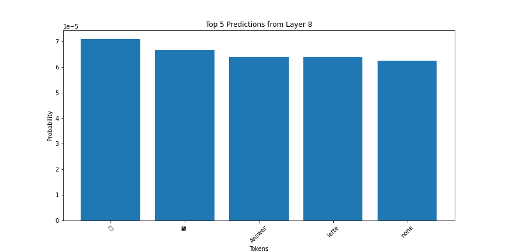
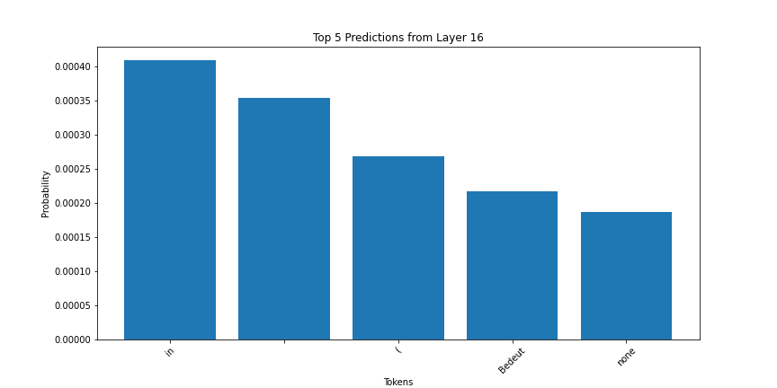
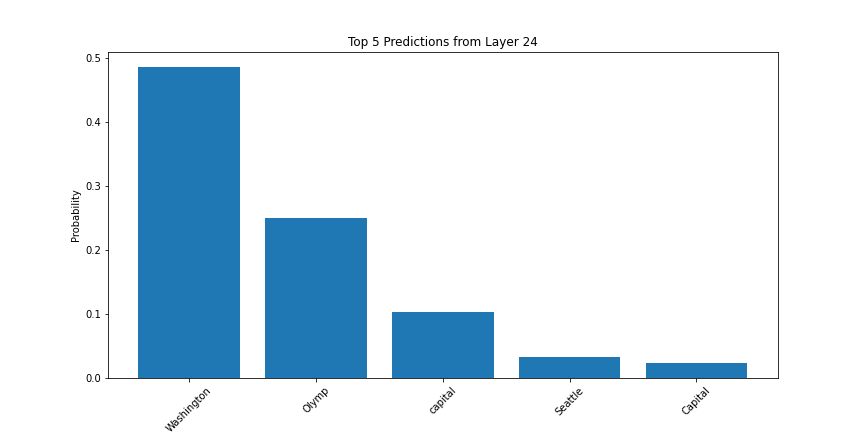
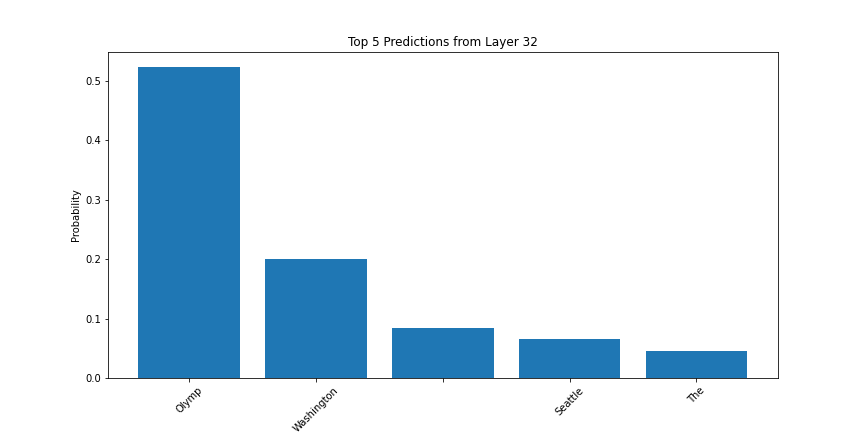
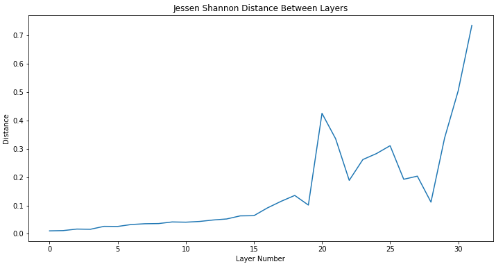
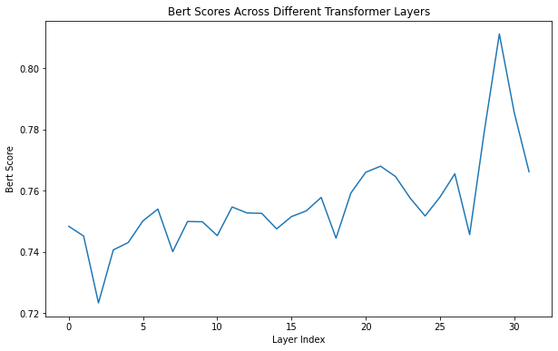

## llama-layer-evolution

# Top K layer predictions

The Following table illustrates the progression of token level predictions through out the sequential forward pass of the LLAMA-2 (alpaca fine-tuned) architecture.
The input text used during the forward pass was *"What is the capital of Washington? Answer:"*

The earlier layers clearly indicate deteriorated performance, compared to their later-in-sequence counterparts.
[Chuang, Yung-Sung, et al. "Dola: Decoding by contrasting layers improves factuality in large language models." arXiv preprint arXiv:2309.03883 (2023).](https://arxiv.org/pdf/2309.03883.pdf%E2%80%8D)

<table>
  <tr>
    <td></td>
    <td></td>
  </tr>
  <tr>
    <td></td>
    <td></td>
  </tr>
</table>

# Factuality Check

We can see in the later layers of the factuality evaluation that a larger JSD value is achieved.
Implying a more likely output that is rooted in factual statements.

# BERT Score Evaluated at Layer-level Embedding

All layers were evalued on the alpaca dataset to determine their BERT score compared to the ground truth.

## Recreating Results:
1. Create env using requirements.yml
2. Run sub.py

